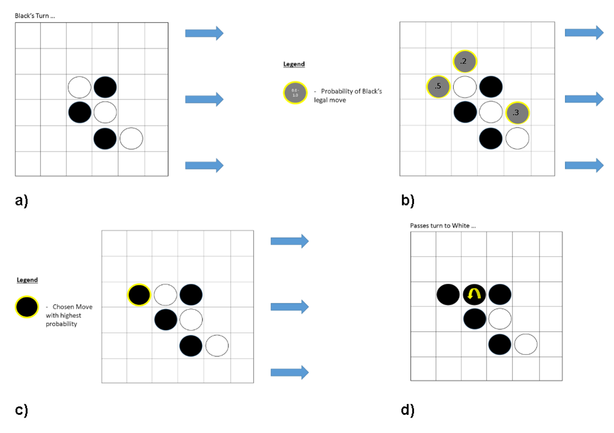
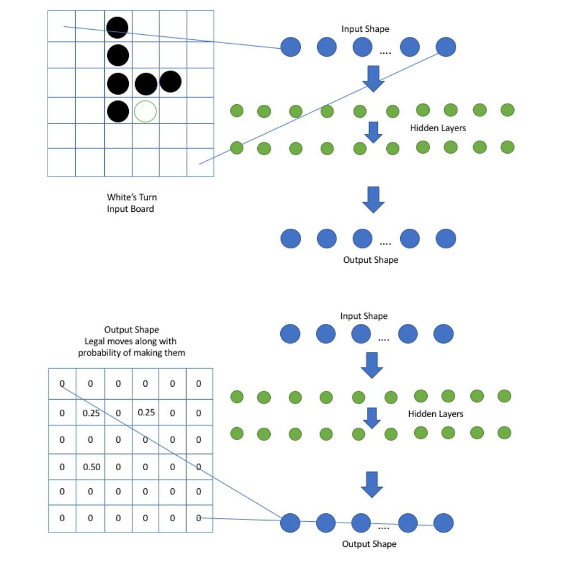

# Learning to play Othello : A simplified self-play approach using a dense neural network
##### Ben Tidswell, Gabriel Dell'Accio, Kushin Mukherjee
###### Vassar College

-------------------
-------------------

On March 15th 2016, Google Deepmind’s AlphaGo defeated Go grandmaster Lee Sedol. It was a historic moment for artificial intelligence, comparable to the miraculous defeat of Garry Kasparov at the hands of DeepBlue at Chess.

On May 13th 2018, a simple deep neural-network built by a few Vassar undergraduates defeated Kushin at Othello. Who is Kushin, you ask? An Othello grandmaster, perhaps? No, he’s just some guy who knows the rules of the game. But it was a significant victory nonetheless.

There have been several successful attempts at teaching networks how to play Othello, some employing novel strategies including self-play, actor-critics, and iterative deepening.

These networks produce highly competent AI-players, which are able to play toe-to-toe with experts.

We were interested in whether a much simpler algorithm would also be able to achieve high-level play, given the ability to train the network for a large number of epochs. Thus, we created Othello-DL, a simple three-layer neural network based AI designed to learn to play Othello and developed over Google Colaboratory.

## General Strategy

Most attempts at teaching neural networks board games include some combination of feeding the network board states along with moves an actual expert would make for those board states, along with some level of self-play.

We opted to remove the first component and have the network learn to improve by simply playing against itself.
      
We utilized a three-layer dense neural network with dropout. The novelty in our approach was in dynamically generating our training data.

Our model would simulate a game of Othello with a 6x6 board. We kept a record of each board state as the game progressed along with the moves each player would make.
Our model would decide which move to make by feeding any given board state to our neural network model and having it output a list of legal moves along with probabilities associated with each move (See figure 1). 

Moves with high-probability values had a higher chance of long-term victory, and the model was more likely to make these moves. If a player won, we would reinforce every move that player made while dampening every other legal move it could have made at every turn. 

Similarly, if a player lost we would dampen every move it did make, while slightly reinforcing every other legal move for each turn. Our prediction was that if we showed the network enough board-states, the simulated player would know which moves to make for any board state to ensure long-term victory.

## Neural Network

Our input for the network was a 36-element array, each element corresponding to a spot on our 6x6 game board. Our final output was also a 36-element array, which consisted of probability values indicating how likely the network was to make a move in any given spot.

The hidden layers consisted of 3 dense layers, with dropout layers between each layer. We used the rectified linear unit activation (ReLu) for the first 2 dense layers, and a softmax activation for the last layer.

Mean squared error sufficed as our loss function, and we chose Adam as our optimizer. 

If the predictions made by the model helped it win, a target array was generated where the probabilities of making the moves it did make were set to 1, and the probabilities for all other moves set to 0.
     
If the player lost, for the target array the probability of making the moves it did make were set to 0, and all other probabilities were re-normalized such that they summed to 1.

The target array only dealt with legal moves.
We would allow our model to play 8 games, corresponding to our number of batches, and stack our target arrays and our board states.

The array of board states for 8 games would be our inputs for each batch, and the target arrays would be, unsurprisingly, the targets.
Thus every 8 games the model would perform backpropagation to update its weights to improve its predicting power.

Since each epoch consisted of only 8 games, which can only produce a limited number of board states, we ran our model for over 100,000 epochs to give it a variety of boardstates to learn from

## Results

Kushin couldn’t keep up with the model after only 1000 epochs.
However, more rigorously, after 100,000 epochs the model performed quite well against a human opponent. It played around 50% of its games to a tie or victory.

It is significant to note that this performance comes about only through the network playing against itself, with no external guidance. A shortcoming of this method is that it lacks elegance in the way it learns. To be truly robust, the network must be trained on several hundreds of thousands of games. We know that humans do not need to play so many games to reach skillful levels of play. Modifying the network architecture, using different parameters and loss/optimizing functions might increase performance. But as it stands, the network is quite capable despite the simplistic learning approach. 

## Running the Model
### Accessing the Model

The general model can be found on 
https://colab.research.google.com/drive/1osAMLibCxw1SLgDOE3u0k8MPIT2E2VMB#scrollTo=iJa5bOKRMRYO&uniqifier=8

### Downloading Keras

The following are useful resources for downloading and installing dependencies you will need to run this model on your own machine.
https://ankivil.com/installing-keras-theano-and-dependencies-on-windows-10/	https://www.dataweekends.com/blog/2017/03/09/set-up-your-mac-for-deep-learning-with-python-keras-and-tensorflow

### Downloading Pygame and Numpy

To run this you will also need pygame and numpy. We recommend using pip to get these. To download pip run “easy_install pip”. Once pip is installed run “pip install pygame” and “pip install numpy” to download pygame and numpy respectively. 

### Playing Against the Network

With Keras, pygame, and numpy set up you are now ready to run code so that you can play Othello against the trained neural network. Simply run “python pygameOthelloNN.py” in the correct environment for Keras. Make sure that the weights file (Othello-Epoch-100000-Drop-0.05-Batch-8.hdf5) is in a folder called “Network Weights” as it saved her on Github. Click on the square where you want to make your move. All legal moves are outlined in blue. Once the game is over the winner is announced and you will need to rerun the code to play again.

### Playing Against Your Friends

If you are tired of playing against a trained neural network, play against your friends instead! If you run “python pygameOthello.py” you will get the two player version. You do not need Keras to run this. You can also change the size of the board by changing line 6 from “boardSide = 6” to “boardSide = ##” where ## is an even number less than 100. While it is possible to go up to a board of size 98 by 98 we do not recommend going above 20 due to the play time and visual issues. However the code will allow you to go up that far, if you want. 

### Other Files

In the Network Weights folder there are other results of our training the network  in the folder Alternate Weights. Each is labeled with the number of epochs it was trained for. Presumably the weights with less training will be easier to beat, if you want a different gameplay experience. To change the weights used change line 41 in pygameOthelloNN.py from “filename = "Network Weights/Othello-Epoch-100000-Drop-0.05-Batch-8.hdf5" to “filename = "Network Weights/Alternate Weights/Othello-Epoch-#####-Drop-0.05-Batch-8.hdf5" where ##### is the number of epochs. The options are 20000, 28000, 38000, and 80000.
